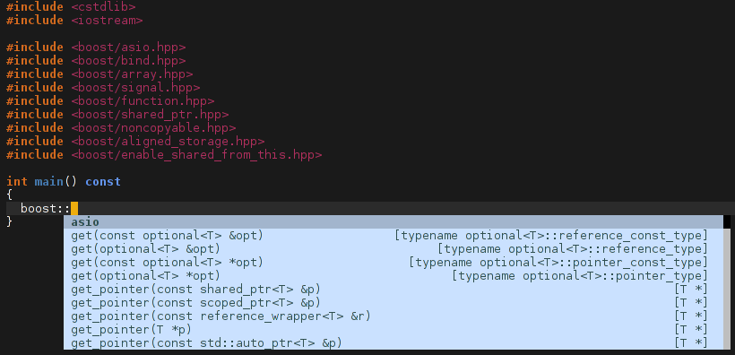

# [Auto-complete][ac-ref] support for [irony-mode][irony-mode-ref]

This package provides an [auto-complete][ac-ref] source for
[irony-mode][irony-mode-ref]. It provides semantic completion for C/C++ and
Objective-C languages.


## Status

**This package is not yet ready for prime-time, this documentation is therefore
a work of fiction.**


## Screenshots




## Dependencies

This package depends on:

* [auto-complete][ac-ref]
* [irony-mode][irony-mode-ref]
* [yasnippet][yasnippet-ref] (optional, used when available by `irony-mode`)

Please refer to the documentation of these packages for the basic configuration
needed to get started.


## Installation

The recommended way to install `ac-irony` and its dependencies is to use a
package manager.

* Using [MELPA](http://melpa.milkbox.net/)

        M-x package-install RET ac-irony RET

* Using [el-get](https://github.com/dimitri/el-get)

        M-x el-get-install RET ac-irony RET


## Configuration

~~~el
(require 'ac-irony)
(require 'yasnippet)

(defun my-irony-hook ()
  ;; be cautious, if yas is not enabled before (auto-complete-mode 1), overlays
  ;; *may* persist after an expansion.
  (yas-minor-mode-on)
  (auto-complete-mode 1)

  (ac-irony-enable)
  (define-key irony-mode-map [(control return)] 'ac-complete-irony))

(add-hook 'irony-mode-hook 'my-irony-hook)
~~~


## FAQ

__auto-complete acts strangely, it tries to complete inside string literals...__

In order to enable header completion, such as:

```cpp
#include "heade[COMP]
```

The `ac` plugin allows `auto-complete` to complete inside string literals in
`ac-irony-enable`.

```el
(setq ac-disable-faces (delq 'font-lock-string-face ac-disable-faces))
```

Please create an issue if you find this unacceptable.


[irony-mode-ref]: https://github.com/Sarcasm/irony-mode          "Irony Mode"
[ac-ref]:         https://github.com/auto-complete/auto-complete "Auto Complete"
[yasnippet-ref]:  https://github.com/capitaomorte/yasnippet      "YASnippet"
